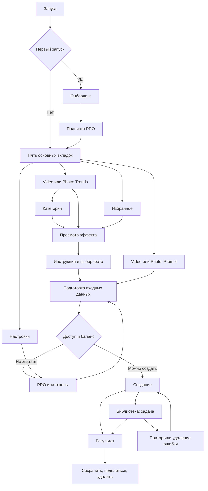

# AiVideoTest: план экранов и сценариев

Дата: 6 октября 2026. Статус: P1–P5 реализованы в пределах демо: каталоги / навигация, Prompt → фото → Result, Library / Favorites, экспорт / удаление результатов и PRO / Tokens с demo-покупками / restore. Подробности — `first-batch-report.md`, `second-batch-report.md`, `third-batch-report.md`, `fourth-batch-report.md`; следующая порция P6 — онбординг и полные Settings.

## Цель первого этапа

По ответу пользователя: **все экраны и сценарии на демонстрационных данных**. Результат — запускаемое Android-приложение, в котором можно пройти сценарии из PDF, увидеть успешные и ошибочные состояния, вернуться назад и продолжить после перезапуска. Генерация, подписка, покупка токенов и восстановление покупок моделируются локально. Денежных списаний и запросов к серверу на этом этапе нет.

Источник: `157 - Higgsfield AI (Vlad, 06.08.2025) (Copy) (Copy).pdf`, 340 страниц, около 646 MiB, файл из Downloads. Извлечён текст всех 340 страниц, просмотрены контактные листы всех страниц; противоречивые и ключевые макеты дополнительно рассмотрены в увеличении. Номера ниже — физические страницы PDF, начиная с 1.

Это экспорт отдельных объектов: кроме экранов, в нём есть изображения для онбординга, варианты компонентов, фоновые фигуры, подписи условий и стрелки. Общая раскладка Figma и связи прототипа не сохранены. Поэтому описанные ниже переходы — предлагаемая реконструкция сценариев; наличие конкретного макета и его элементов проверено по PDF. Реестр всех страниц находится в `pdf-screen-inventory.md`.

## Исходное состояние проекта

Один модуль `app`, minSdk 24, compileSdk и targetSdk 37. Порции 1–4 реализованы на демоданных. По запросу пользователя UI переведён на Jetpack Compose / Material 3, навигация — Navigation Compose. AppViewModel, DemoSession и сохранённые данные остаются прежними. Серверного слоя нет. Подробности — в `compose-migration-report.md`.

Все текущие и будущие экраны, общие компоненты, диалоги и sheets реализуются в Compose, в том же модуле. Цветовые и числовые типографические ресурсы остаются источником токенов. XML сохраняется для системной темы, иконок и платформенных ресурсов.

## Карта продукта и повторное использование

Внизу пять разделов: AI Video, AI Photo, Favorites, Library, Settings. Video и Photo имеют режимы Trends / Prompt. Catalog, Category, Effect, Prompt, Creating, Result, диалоги и работа с фотографиями повторяются в разных ветках. План ниже сводит экспорт к **16 семействам интерфейса**, а не предполагает 340 отдельных Android-экранов. Некоторые семейства реализуются как sheet или набор шагов одного экрана.

| ID | Семейство | Опорные страницы | Основные варианты |
| --- | --- | --- | --- |
| S01 | Splash | 5 | Старт, переход к онбордингу / приложению |
| S02 | Онбординг | 6–12, иллюстрации 1–4 | Знакомство, prompt, sharing, отзыв, уведомления; разрешение на фото |
| S03 | Запрос оценки | 25–26, 336 | Yes / No, закрытие, демонстрация ответа |
| S04 | Подписка PRO | 13–18 | Выбор тарифа, разные размеры экрана, закрытие; успех / отмена / ошибка покупки как добавляемые demo-состояния |
| S05 | Пополнение токенов | 19–24 | Пакеты, баланс, покупка; успех / отмена / ошибка как demo-состояния |
| S06 | Каталог Trends | 43–44, 67–68, 76, 152, 156, 161–162, 211 | Video / Photo, баннер, секции, лайки, PRO / обычный баланс |
| S07 | Категория / See all | 117, 207 | Сетка, горизонтальные категории, избранное |
| S08 | Prompt | 48–52, 59, 74, 79–94, 157–180 | Video / Photo; ввод, copy / clear, лимит, фото, разрешение / стиль, клавиатура |
| S09 | Просмотр эффекта | 118, 125, 134–135, 143, 208, 218, 225–226, 230, 246 | Фото / видео, like, Use this effect, подсказка Scroll Down |
| S10 | Инструкция к фотографии | 64, 119, 136, 209, 227, 247 | Good / Bad choice, Continue, первый / повторный показ |
| S11 | Выбор источника фотографии | 54, 56, 71, 120–121, 130, 137, 139, 145, 210, 216, 219, 228, 232, 234, 249, 252, 280 | Sheet, камера / галерея, выбор / отмена, загрузка / ошибка / retry |
| S12 | Создание результата | 97, 186, 239, 258 | Ожидание Video / Photo, выход к своим делам, готовность / ошибка |
| S13 | Просмотр результата | 99–115, 122–123, 188–205, 212–213, 260–278, 283–284, 290, 300–324 | Фото / видео, меню, save / files / share / delete, успех / ошибка |
| S14 | Избранное | 240, 242–244, 279, 282, 285 | Photos / Videos, empty / content, like / unlike, вход в общий сценарий эффекта |
| S15 | Библиотека | 241, 286–288, 291, 293, 295, 297–298, 304, 306 | Photos / Videos, empty / content / generating / failed, retry / delete |
| S16 | Настройки | 326, 328, 334–337, 339–340 | Статус подписки, баланс, уведомления, share / rate / support / restore / cache / legal |

Отдельные общие компоненты: заголовок с балансом, нижние вкладки, segmented control, медиакарточка, баннер, поле prompt со счётчиком, стиль, resolution pill, карточка тарифа, menu / action sheet, confirmation / error dialog, toast / snackbar. Источники состояний компонентов: 27–40, 60–61, 77–78, 82–83, 116, 133, 206, 224 и предыдущие PDF дизайн-системы.

Для Terms, Privacy, Letter и Report a problem в PDF есть точки входа, но нет отдельных макетов и содержимого. Предлагается общий демонстрационный экран текста / информации с Back. Это добавляемое покрытие действий, а не обнаруженные экраны. Debug-панель выбора сценариев также не является частью продуктового дизайна.

## Предлагаемая схема переходов

Схема — проектное предложение. Порядок запроса разрешений, показ PRO после онбординга и точный выбор PRO / Tokens при недостаточном доступе требуют сверки: разрозненные стрелки PDF не задают однозначный граф. При возврате из offer / picker / Result сохраняем вкладку, фильтр, прокрутку и введённые данные.

## Состояния и правила демонстрации

| Область | Нужные состояния | Правило реализации |
| --- | --- | --- |
| Prompt | Empty, Valid, AtLimit, OverLimit | 0, 1, 299, 300, 301 символ; Generate неактивна при пустом / недопустимом вводе |
| Reference photo | Absent, Selecting, Loading, Ready, Failed | Cancel не стирает прежнее фото; Ready даёт удалить / заменить; Retry воспроизводит переход |
| Доступ | Free / PRO независимо от Balance | Отдельные параметры; баланс не становится «безлимитным» автоматически |
| Задача | Queued, Running, Succeeded, Failed | Общий ID задачи для Creating и Library; выход с Creating не удаляет задачу |
| Результат | Image / Video | Медиатип определяет просмотр и экспорт; результат выбирается из локальных fixtures |
| Экспорт | Idle, Saving, Saved, Failed | Разные пути gallery / files; отказ, отмена, повтор; текст подтверждения соответствует операции |
| Избранное | Empty, Content, Added, Removed | Лайк синхронизируется с каталогом и эффектом по одному ID |
| Library | Empty, Content, Running, Failed | Список обновляется из тех же задач; retry / delete без дублирования карточек |
| Покупка / restore | Idle, Loading, Success, Cancelled, Failed | Локальная симуляция, без платёжных SDK; повторный callback не удваивает баланс |
| Settings | Subscription, Notifications, Cache | Данные общие со всей навигацией; очистка кэша сохраняет историю |

Для всех сценариев нужен явный debug-переключатель, чтобы проверяющий мог выбрать успех или конкретную ошибку, начальный баланс, PRO, пустые списки и незавершённую задачу. Поведение детерминированное; ошибки не выбираются случайно. Добавить Reset demo и Skip onboarding только в debug.

Зафиксировать в реализации:

- Каталог и медиа — локальные примеры; генерация через задержку и выбранный исход. В демо достаточно короткого времени ожидания, настраиваемого в debug. Указанные в макете «1–2 минуты» не являются реальным SLA.
- Happy path должен иметь достаточный баланс. Fixtures «5 токенов при цене 10/30» используются для недостаточного баланса / проверки противоречий, не для свободного создания.
- Стоимость / право доступа задаются данными сценария, не числами в кнопке. Списание — один раз на принятую задачу; политика возврата при ошибке отдельно конфигурируется и помечается временной.
- Сохраняются онбординг, demo-покупки, баланс, избранное, список задач и настройки. Переход в фон / поворот не повторяет покупку или списание. После восстановления процесса статус восстанавливается по сохранённой задаче, а не по времени жизни View.
- Лайк эффекта и созданный результат имеют разные ID. Связь Favorites с результатами требует уточнения; по ветке Use this effect первоначально трактуем Favorites как любимые эффекты.
- Delete убирает задачу / результат из Library после подтверждения. Файлы, уже экспортированные пользователем, отдельно не удаляются. Показанная необратимость относится к истории приложения.
- В продуктивном интерфейсе нет технических переключателей. Демонстрационный статус покупок и генерации должен быть понятен при обзоре сборки, чтобы результаты не выдавались за серверные.

## Android и внешние действия

Системную камеру, picker, клавиатуру и share sheet не рисуем как iOS-компоненты приложения. Для первого этапа предусматриваем локальные demo-адаптеры с контролируемыми исходами, а при наличии устройства — Android-адаптеры для фото, сохранения и отправки тестового медиа. Ни одна ветка не зависит от аккаунта в магазине или наличия backend.

| В PDF | В демо Android | Граница |
| --- | --- | --- |
| Камера iOS | Android Activity Result / камера + выбор demo-фото для проверки | Пользователь может отменить; отсутствие приложения камеры не ломает сценарий |
| Галерея, Select up to 4 | Android photo picker с fallback + локальный выбор примеров | Проверять лимит в приложении: fallback может не соблюдать maximum |
| Доступ ко всем Photos | Системный выбор отдельных фото | Не копировать iOS-диалог доступа ко всей библиотеке |
| Share / AirDrop | Android Sharesheet либо demo-ответ | Отправка происходит только по действию пользователя; content URI и корректный MIME |
| Save to gallery / files | MediaStore / системный выбор файла или управляемая симуляция | На старых API учесть разрешения; отмена не означает успех |
| Уведомления | Demo-флаг и Android-разрешение при тестировании | Разделить пользовательскую настройку и разрешение ОС; ошибка / отказ не блокируют приложение |
| Оценка App Store | Demo-сценарий оценки | Реальное Google Play Review вне первого этапа; его появление не гарантируется |
| Подписка / restore | Локальные demo-сценарии | Без Billing, денег и серверной проверки |
| Report / Letter | Демонстрационный информационный экран | Отправка писем не подключается; адресов / конечных страниц в макете нет |

Технические основания: [Photo picker](https://developer.android.com/training/data-storage/shared/photo-picker), [разрешение уведомлений](https://developer.android.com/develop/ui/compose/notifications/notification-permission). Детальные платформенные адаптеры проверяются на minSdk и актуальном устройстве при реализации.

## Организация кода

Один ComponentActivity с setContent, NavHost и общей оболочкой Compose. Состояния экранов находятся в ViewModel; события изменяют состояние, а отображение только его читает. Для основной логики это соответствует [рекомендациям Android](https://developer.android.com/topic/architecture/recommendations).

Предлагаемая структура внутри текущего пакета `com.rslnabk.aivideotest`:

- `ui/common` — элементы и общие sheets / dialogs;
- `ui/onboarding`, `ui/catalog`, `ui/generator`, `ui/effect`, `ui/result`, `ui/favorites`, `ui/library`, `ui/settings`, `ui/offers` — интерфейс по областям;
- `model` — Effect, Category, MediaKind, GenerationRequest, GenerationJob, SubscriptionState, TokenBalance, DemoScenario;
- `data/demo` — локальные fixtures, управление исходами, сохранение состояния;
- `data` — небольшие контракты repositories и media / export adapters; реальная реализация добавится позже.

Зависимости добавлять под конкретные задачи, а не заранее. Не вводить Room, DI-фреймворк, WorkManager, Billing или сетевой клиент без необходимости демо. Долгие реальные фоновые задачи и платежи будут отдельным архитектурным решением следующего этапа.

Ключевой контракт: все экраны читают общие данные; локальная кнопка не изменяет одновременно собственный баланс и второй независимый список истории. В частности, Creating и Library показывают одну задачу, Catalog и Favorites используют одно состояние лайка.

## Порядок реализации и контрольные результаты

Все пакеты входят в первый этап. Порядок отражает зависимости, а не исключение поздних экранов. После каждого пакета — запускаемая сборка, сверка с опорными страницами PDF и краткий список завершённых / оставшихся сценариев.

| Пакет | Работа | Зависит от | Результат для проверки | Сложность |
| --- | --- | --- | --- | --- |
| P0 | Реестр, решение противоречий, assets / fixtures | — | Этот план и перечень исходных состояний; реестр готов, assets ещё подготовить | Средняя |
| P1 | MainActivity, навигация, insets, общая шапка / баланс, demo-state / reset | P0 | Приложение запускается, работают 5 вкладок и Back; состояние не теряется при повороте | Средняя |
| P2 | Trends Video / Photo, категории, карточки, баннер, Effect, базовые лайки | P1 | От каждой карточки и See all можно дойти до эффекта и вернуться; каталоги различаются данными | Большая |
| P3 | Prompt обоих типов, фото / инструкция, валидация, Creating, базовый Result | P2 | Первый полный маршрут от ввода / эффекта до demo-результата, с неуспешной загрузкой фото | Большая |
| P4 | Result actions, библиотека, избранное, общий жизненный цикл задач | P3 | Save / files / share / delete, empty / running / failed / retry, синхронизация лайков и истории | Большая |
| P5 | PRO / Tokens, все доступы и балансы, demo-покупка / restore | P4 | Покупка изменяет общие данные и возвращает к сохранённому prompt; доступны success / cancel / error | Средняя |
| P6 | Онбординг, rate / permissions, Settings, legal / support demo | P5 | Первый / повторный запуск, настройки и все внешние точки входа проходимы | Большая |
| P7 | Полная матрица сценариев и визуальная доводка | P6 | Закрыты все строки реестра приложения; сборка, сценарные тесты, screenshots и список согласованных отклонений | Большая |

Почему последовательность такая: сначала проверяем самое дорогое взаимодействие каталога, ввода, медиа и результата. Онбординг и предложения подключаем к уже работающему сценарию. Это позволяет рано проверить основу и затем достроить весь объём.

Календарную оценку пока не фиксируем: на неё сильно влияют доступность видео / графики, требуемые анимации и решения по неоднозначностям. После P1–P3 будет основание для оценки оставшейся работы по фактической скорости и качеству первого маршрута.

## Рабочий backlog

| Задача | Пакет | Проверяемый результат |
| --- | --- | --- |
| A01 | P0 | Сопоставить assets с S01–S16; выделить изображения, удалить дубли, подготовить небольшие локальные видео |
| A02 | P0 | Зафиксировать временные правила стоимости, PRO, фото / стилей, текста и именования |
| A03 | P0 | Подготовить данные: категории, эффекты обоих типов, тарифы, пакеты, задачи и исходы ошибок |
| A04 | P1 | Создать точку запуска и общую оболочку, тему собственного header, insets / edge-to-edge |
| A05 | P1 | Настроить 5 вкладок, Back, возврат к спискам и удержание состояния вкладок |
| A06 | P1 | Создать общее demo-хранилище, сохраняемые данные, debug-сценарии / reset / skip |
| A07 | P2 | Собрать reusable медиакарточку, баннер, segmented control и баланс |
| A08 | P2 | Собрать два Trends на общей структуре с разными fixture-данными |
| A09 | P2 | Добавить See all / category chips, Effect и его состояние лайка / подсказки |
| A10 | P3 | Собрать общий Prompt с отдельной конфигурацией Video / Photo |
| A11 | P3 | Добавить лимит 300, копирование / очистку, счётчик, long text / keyboard / disabled |
| A12 | P3 | Добавить Instruction, source sheet и локальные фото; внешние Android-адаптеры по возможности устройства |
| A13 | P3 | Воспроизвести загрузку фото, успех / error / cancel / retry / replace / remove |
| A14 | P3 | Создать задачу, Creating и базовый Result обоих mediaKind |
| A15 | P4 | Собрать Favorites с empty / content и двумя типами медиа |
| A16 | P4 | Собрать Library с empty / content / running / error; входом в Result |
| A17 | P4 | Подключить Result menu, save / files / share и общий action state |
| A18 | P4 | Добавить delete confirmation / cancellation, ошибки экспорта, повтор, snackbar / dialog |
| A19 | P4 | Проверить возвращение к правильному списку и единую задачу после ухода с Creating |
| A20 | P5 | Собрать PRO / Tokens, выбор пакета / тарифа и адаптацию высоты |
| A21 | P5 | Добавить demo-purchase / restore: loading / success / cancelled / failed |
| A22 | P5 | Подключить gate, баланс и возврат в незавершённый сценарий без двойного списания |
| A23 | P6 | Собрать Splash и шаги онбординга с сохранением завершения |
| A24 | P6 | Добавить сценарии отзывов и разрешений с корректным отказом / повторным входом |
| A25 | P6 | Собрать Settings: три карточки подписки, уведомления, clear cache / restore |
| A26 | P6 | Закрыть share / rate / report / letter / legal точки входа демонстрационными адаптерами |
| A27 | P7 | Пройти сценарную матрицу, проверить cross-tab синхронизацию и восстановление процесса |
| A28 | P7 | Сверить опорные скриншоты, компактные экраны, масштаб шрифта, клавиатуру и gestures |
| A29 | P7 | Оптимизировать картинки / видео, загрузку / playback, проверить размер и плавность сборки |
| A30 | P7 | Закрыть реестр покрытия и выпустить проверяемую demo-сборку со списком отклонений |

## Матрица приёмки

Это минимальный набор критических комбинаций, а не требование проверить декартово произведение всех состояний.

| Группа | Проверки |
| --- | --- |
| Запуск | Новый пользователь, завершённый онбординг, пропуск / закрытие offer, перезапуск |
| Навигация | Все 5 вкладок, Trends / Prompt, Photos / Videos, Back из category / Effect / Result / sheet, возврат к origin |
| Каталог | Баннер Try, See all, category selection, like / unlike в каталоге и Effect, соответствие Favorites |
| Prompt | 0 / 1 / 299 / 300 / 301, ввод и вставка, пробелы, эмодзи / кириллица, copy / clear, длинный текст, IME |
| Фото | Камера / picker / demo, cancel, отсутствие permission, error, retry, delete / replace; лимит выбора |
| Генерация | Video prompt, Photo prompt, Video effect, Photo effect; success / failure; уход в Library до завершения |
| Баланс | Free / PRO × zero / insufficient / sufficient, изменение после demo-покупки, повторный тап и отсутствие двойного списания |
| Библиотека | Empty, running, failed, retry, result ready, delete / cancel, последнее удаление до empty |
| Избранное | Empty, оба типа, unlike из разных мест, вход в Effect и возврат к Favorites |
| Экспорт | Image / Video × gallery / files / share; success / cancel / failure / retry; независимость экспорта от удаления истории |
| Offers | Два тарифа, пакеты, закрытие, success / error / cancel, restore, возврат к сохранённому запросу |
| Settings | Три состояния подписочной карточки, notification on / off / отказ ОС, clear / cancel cache с сохранением истории, все ссылки |
| Lifecycle | Поворот и восстановление процесса на Prompt, Creating, Library, после покупки; отмена системного picker |
| Layout | Экран 390×844 как опорный макет, компактный экран, landscape где применимо, увеличенный шрифт, навигационные панели и клавиатура |
| Совместимость | minSdk 24; граница веса шрифта API 28; API 33+ разрешения; целевой API на доступном эмуляторе |

Автотесты при реализации направить на существенную логику: валидацию, создание / retry / delete задач, единственное списание, синхронизацию избранного, cache-vs-history и восстановление. UI-тестами пройти основные маршруты и отказ / отмену системного действия. Визуальные screenshots сравнивать с опорными состояниями каждого семейства; существующий стартовый arithmetic test не является проверкой сценариев.

«Готово» для экрана: оформление сопоставлено с PDF, все видимые действия доступны, состояние восстанавливается, happy / empty / loading / error пути по матрице проверены. «Готово» для первого этапа: каждый маршрут реестра закрыт реализацией или явно согласованной Android-адаптацией; нет необработанных кликов и случайно недоступных ошибок.

## Неоднозначности и предлагаемые временные решения

| Вопрос | Где видно | Предложение для demo; не утверждённое правило продукта |
| --- | --- | --- |
| Что считается символом при лимите 300, особенно эмодзи | 27, 37, 86, 154, 173 | Определить подсчёт Unicode до A11; одинаковое правило для счётчика, валидации и вставки |
| Стоимость 10 / 30 против баланса 5 и 2 | 48, 51–52, 59, 94, 97, 157, 178, 186 | Раздельные fixtures; цену хранить в данных, успешному сценарию дать достаточный баланс |
| Unlimited generation в PRO и отдельные токены | 13–18, 19–24, 36, 67, 161 | PRO и баланс моделировать раздельно; конкретные ограничения задать сценарной политикой |
| Тариф Year превращается в Week; одинаковые пакеты | 13–14, 19–24 | Year / Week как две карточки из стр. 13; остальные несогласованные копии оформить отклонением, не придумывать коммерческие SKU |
| Стиль Photo на экране Video | 59, 81–83 против 48 и 157 | Resolution активен только для Video; стили активны для Photo, на Video при необходимости показать отключённый блок как на стр. 59 |
| Creating a video на ветке Photo | 186, 239 | Общий Creating с текстом по mediaKind; исправление текста согласовать при верстке |
| Фото: одно attachment, picker «up to 4» | 59, 71, 130, 145, 219, 234, 280 | Хранить список, лимит задавать конфигурацией; до решения основной вход — одна reference photo |
| Favorites / Wishlist, Library / History, Home / AI Video; Why «start writing» | 54, 240–244, 286–288 | Вкладки оставить как в нижней навигации; заголовки нормализовать при согласовании копирайтинга |
| Favorites — эффекты или готовые результаты | 244, 246–258, 279–285 | Предварительно любимые эффекты: ветка ведёт в Use this effect; не смешивать их с job-ID |
| Что делает Okay на Creating, когда показывается уведомление | 97, 186, 239, 258 | Вернуться к origin / Library, задача живёт дальше; уведомление как отдельный demo-event |
| Возврат токенов при генерационной ошибке, стоимость retry | 293–297 | Вынести в конфигурацию сценария, зафиксировать до подключения реального сервера |
| Ошибки Save говорят о server, хотя операция локальная | 122–123, 212–213, 283–284, 323–324 | Показывать ошибку операции экспорта; успех не появится до завершения действия |
| Ошибки / опечатки текста и повтор subtitle про фото в Library error sheet | 25, 29, 295, 297 и другие | Список исправлений отдельным review; сохранять происхождение исходного текста |
| Notification toggle и системное разрешение | 11–12, 334 | Отдельные состояния preference / OS permission; собственное окно не выдавать за системное |
| Когда появляется Instruction / Scroll Down | 64, 119, 134, 136, 225, 247 | Первый показ / debug forcing; не вставлять заново перед каждым действием без решения |
| Нет экрана поддержки, юридических текстов и настоящих ссылок | 326, 328 | Общий demo-content экран, явные placeholders; наружные сообщения не отправлять |
| PDF содержит статичные кадры видео / анимаций | 1–4, 9, 97, 99, 118, 186 и другие | Извлечь изображения для demo; локальные test clips. Для точного движения нужны исходные видео / анимации |
| SF Pro и размеры токенов против отдельных экранов | Предыдущая дизайн-система и текущие макеты | Оставить документированный Android fallback; измерять реальные роли на экранах и фиксировать конфликт метрик |
| Смысл стрелок, удаление / запуск из разных источников | Служебные страницы по всему файлу | Маршруты считать реконструкцией; сохранять origin в навигации и уточнять перед реализацией соответствующей ветки |

Ни один пункт не требует останавливать весь план. Оболочка, каталог и общие компоненты независимы от коммерческих правил. Перед пакетом, который зависит от конкретной неоднозначности, фиксируем выбранное demo-поведение в его карточке задачи.

## Что остаётся после demo

Отдельный следующий этап: контракт реальной генерации / хранения, загрузка и безопасность медиа, очередь и фоновые задачи, серверный источник баланса, Google Play Billing и проверка покупок, реальные push-уведомления, поддержка / legal URLs, analytics и production release. В PDF нет API, правил учёта, идентификации пользователя или требований к инфраструктуре. По дизайну нельзя достоверно оценить этот объём.

## Практическая первая порция работы

Начать с A01–A09: подготовка небольшого набора assets, точка запуска, пять вкладок, общие demo-данные, Catalog Video / Photo, Category и Effect. Результат для первого визуального обзора — можно войти в каталог, открыть категорию, посмотреть эффект, поставить лайк и вернуться с сохранением положения списка. Затем A10–A14 дадут полный маршрут до первого demo-результата. Первая порция по A01–A09 выполнена в пределах каталогов и просмотра эффекта; отложенные пункты перечислены в `first-batch-report.md`.
